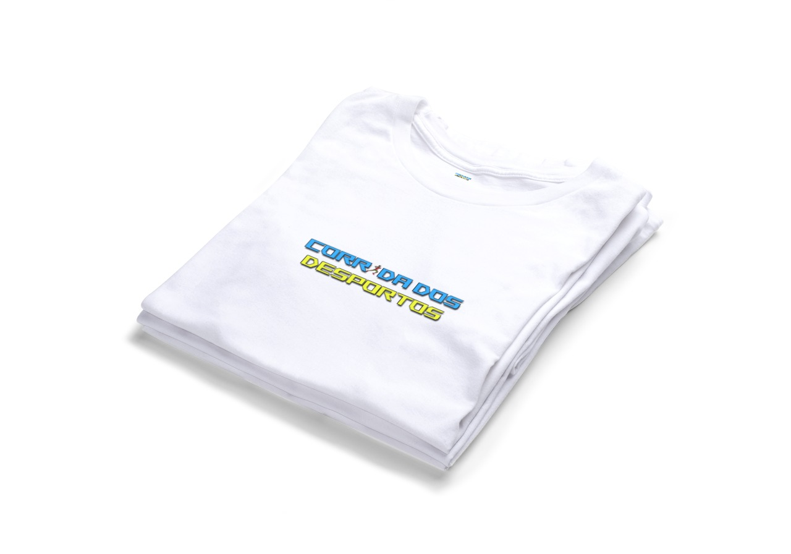

## Corrida dos Desportos

Trabalho realizado por: Duarte Salvador nº22000744

## Descrição do Projeto

Este projeto é um jogo desenvolvido com P5.js, baseado nas premissas definidas na introdução à programação multimédia. O jogo tem como objetivo dar a conhecer vários desportos existentes, realçando também o cuidado que devemos ter ao praticá-los.

## Sinopse

Num mundo onde o desporto é a paixão de todos, existe uma competição lendária chamada "A Corrida dos Desportos". Nesta corrida única, os participantes percorrem um percurso repleto de desafios relacionados a diferentes modalidades desportivas. Os corredores devem desviar-se de obstáculos que representam os desportos mais populares do mundo.

O Desafio
 
 A personagem principal do jogo é um jovem atleta determinado a vencer a Corrida dos Desportos. Ao longo do percurso, ele encontra-se com uma variedade de obstáculos, incluindo:
Barreiras de corridas olímpicas;
Bolas de diversos desportos;
Equipamentos desportivos como raquetes, tacos.

A Jornada
 
 A jornada do atleta começa no Estádio Olímpico, onde a multidão o aplaude enquanto ele se prepara para a corrida. Assim que a corrida começa, o jogador terá que se desviar de obstáculos inesperados que representam cada desporto.
Ao aproximar-se das barreiras de corridas olímpicas, precisa de clicar rapidamente para saltar sobre as mesmas.
De seguida, diversas bolas de diferentes desportos começam a voar na sua direção, e deve clicar para se desviar delas.
Enquanto corre, depara-se também com equipamentos desportivos, que exigem cliques precisos para evitar colisões.

## Layouts e Design de Comunicação
O jogo foi desenhado com um conjunto de layouts que incluem diversos cenários em que podemos visualizar a personagem a saltar por cima de diferentes obstáculos e em posições diferentes.

### Ambiente de Jogo
No meu jogo queria dar o sentimento de algo "retro", com a presença de elementos pixelizados e, por isso inspirei-me nos jogos e gráficos seguintes para realizar o meu design:

### Personagens
A personagem presente no meu jogo é sempre o corredor, no entanto, o mesmo encontra-se em posições diferentes, tanto de corrida (2ª e 3ª imagens), como de salto (1ª imagem). Quanto aos obstáculos, são diversos objetos utilizados em desportos diferentes, tais como, bolas, raquetes e tacos.

  

### Obstáculos

    

### Scoreboard

### Identidade Gráfica
Quanto à identidade gráfica, desenvolvi um logotipo com o corredor e com alguns elementos presentes no jogo, juntamente com o nome do mesmo. Abaixo, apresento também a paleta de cores correspondente ao próprio jogo.

Por fim, após as sugestões dos professores quanto ao logotipo, criei alguns mockups com o logotipo antigo (como a base para copos/canecas) e os restantes com um logotipo novo, mais simplificado.

  

## Vídeo Promocional
Para documentar a utilização do jogo, criei um vídeo promocional de aproximadamente 30 segundos, que pode ser visto [aqui](https://youtu.be/9KEgE3CTHFE)

### Como Jogar
Para este jogo apenas é necessário pressionar a tecla "espaço" de modo a que o corredor consiga saltar, evitando os obstáculos.
